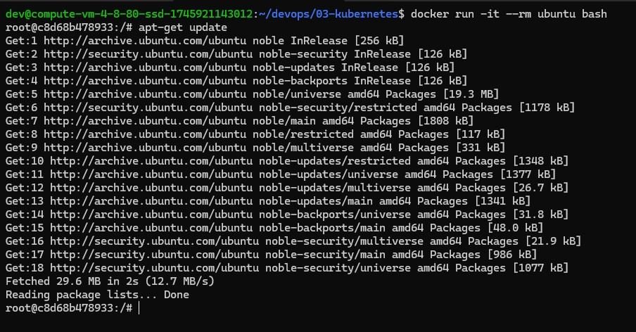
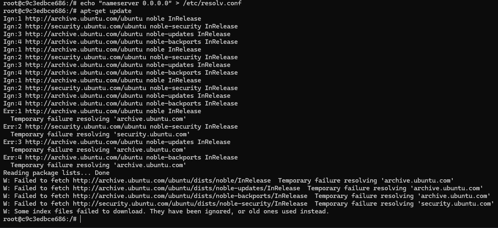
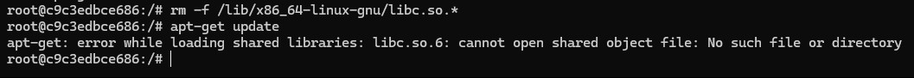

### apt-get update работает:

Так как мы запускаем контейнер не в привилегированом режиме, такие инструменты, как iptables, ip, ufw использовать мы не можем.

### Блокируем выход в сеть:
"Портим" записи DNS, подставляя несуществующий адрес, отчего dns-имена не резолвятся и apt-get не работает

``echo "nameserver 0.0.0.0 > /etc/resolv.conf``

### Блокируем выход в сеть:
Ломаем сетевые вызовы (вместе с большинством системных...)

``rm -f /lib/x86_64-linux-gnu/libc.so.*``

